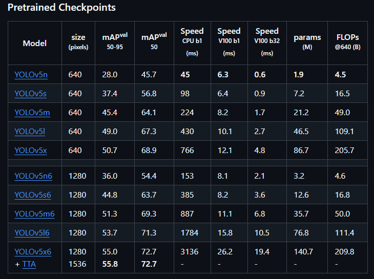
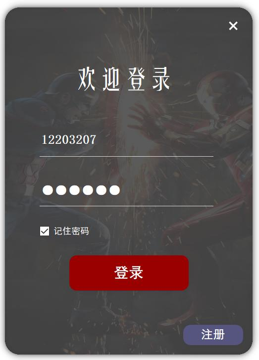
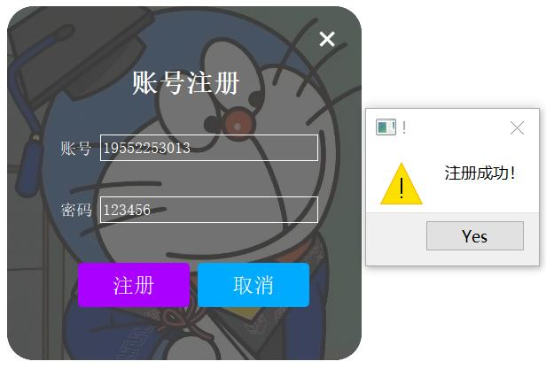
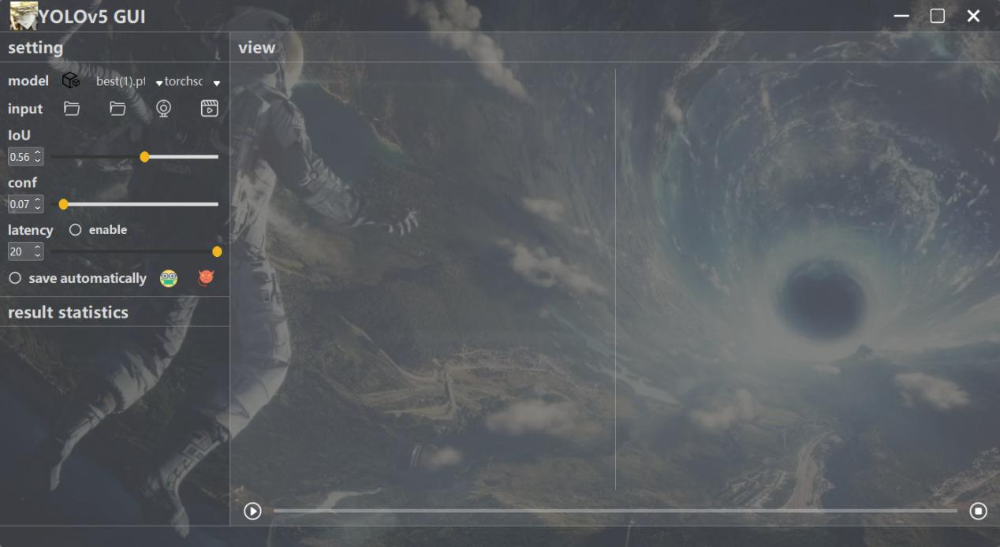
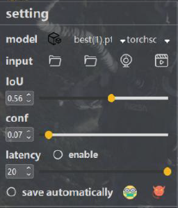
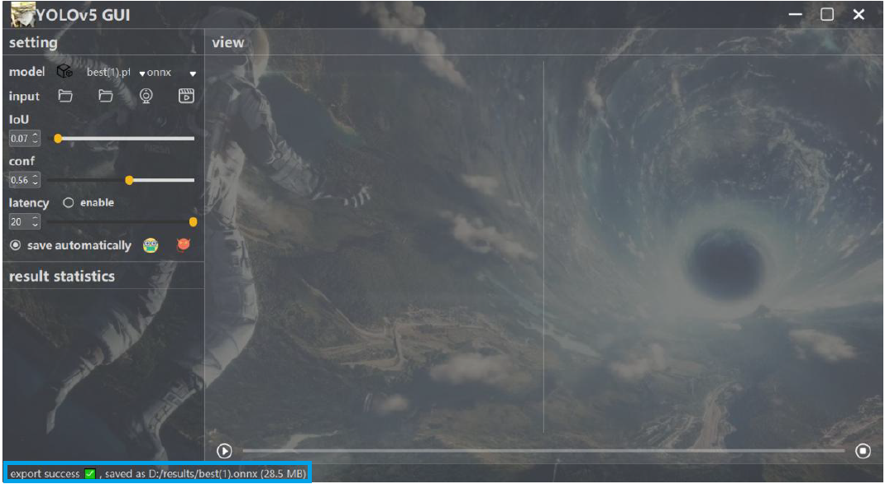
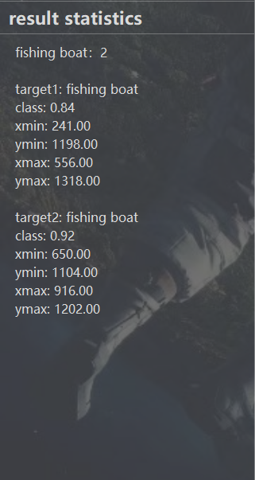
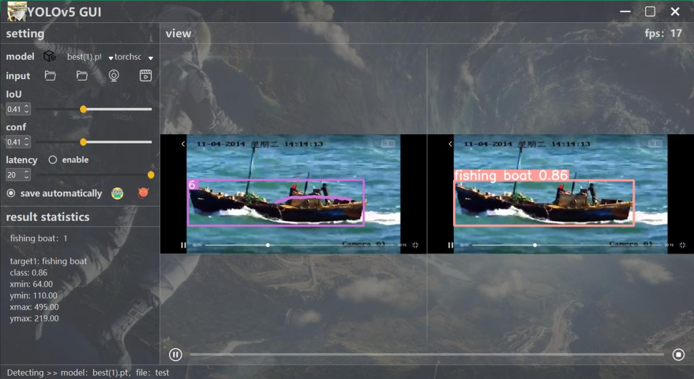

## TIPS

This repo is based on [YOLOv5 v7.0](https://github.com/ultralytics/yolov5/tree/v7.0)

Download the models of YOLOv5 v7.0 from the page mentioned above.
Different versions of pretrained checkpoints can be chosen.

## GUI

Considering that Author Javacr has used PyQt5 to design a quite beautiful GUI, I decided to keep the previous template and do some expansion. It is noted that the new GUI includes external functions compared to the 
original GUI. What's more, the new GUI also supports object tracking. I tried to integrate the tracing module into the entire code so that the new GUI can complete object detection and
tracking simultaneously. To make the project more perfect, the login GUI also be added. It's pity that user information such as username and password are saved in CSV file.
This part could have connected to MySQL. You can use package PyMySQL to achieve later.

Now let's see the new GUI as follows.

Relatively speaking, the login and regiter UI are simple. You can choose to remember the password in order to login the system immediately.
When logining successfully, the UI will jump to the main window which we mostly focused on.

The detection interface inherited from previous version(https://github.com/ultralytics/yolov5/tree/v6.1). In this part, you may see some strange icons which fail to present the function intuitively. Due to the deadline of my graduation project, I'm sorry that
it's too late to search for suitable images. As a result, I used the icons straightly which the original author provided in old version. Later, I will explain what correspondence exists 
between icons and functions to you in detail. This will be helpful for you to understand the entire code better.

## External Functions Compared to the Previous Version

As you can see, the current YOLOv5 GUI can be separeted into three parts(setting、result statistics and view). 

### part of setting

First, you can clearly see the word "model". In Previous version, it's necessary for you to place models in the folder which is named pt. Now you are able to upload your model in real time via clicking the 
black button on the left of model comboBox. Then you can find and switch to the model when clicking the model comboBox. 

Next, the word "input" limits the type of data you can upload. The current version can support uploading picture folders to realize batch recognition. 

Finally, there are two emoticons at the bottom of the setting. By clicking the yellow one, it's available for you to choose the place where the detection results will be saved after 
finishing detecting. Apart from this, I integrated the model conversion module from source code Yolov5. Click the convert_type comboBox on the right of model comboBox, then select the type you want the model to be 
converted to. Now you can click the red emoticon to start to convert the model.

As the picture shows, there will be tips like the content in blue box if you convert the model successfully.

### part of result statistics

In this part, I tried to make the information which is presented more abundant. 
Now you can see class、confidence、position of detection boxes which are related to every target that is detected by Yolov5. 

### part of view

Now you can see the object tracking in left part of view and the object detection in the right. The purple line shows the boat's movement trajectory.